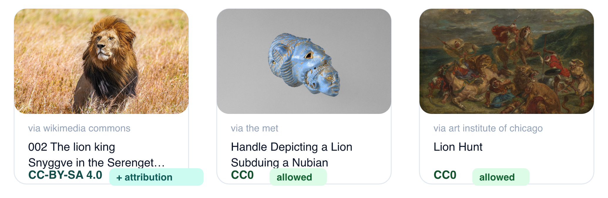

# refkit

Neutral, dependency-light **reference-retrieval toolkit for creative work** — search images / video / audio / text as creative references, with **per-result license normalization** so every result carries `source + license + attribution + canonicalUrl`.



> Apache-2.0 · `v0.2.0` — adds an opt-in, zero-dependency reranker (`lexicalReranker`). The API surface (`createRefkit`) is stable; provider coverage is growing.

## Why

Multimedia creators constantly "search X images as reference" / "find a Y passage for structure". No existing library combines all five of: **multi-source aggregation × per-result license normalization × agent-callable × embeddable BYOK SDK × visual AND text**. refkit fills that gap.

The defensible core is **not** multi-source fan-out (a commodity) — it is the **license normalization + strict-deny use-gate + dual-modal contract**, plus flowing results into a generation pipeline as provenance-carrying assets.

## Install

```bash
pnpm add @refkit/core @refkit/provider-openverse @refkit/provider-met
```

`@refkit/core` is the brain; each source is a thin `@refkit/provider-*` satellite you add as needed.

## Quickstart

```ts
import { createRefkit } from '@refkit/core'
import { openverse } from '@refkit/provider-openverse'
import { met } from '@refkit/provider-met'
import { unsplash } from '@refkit/provider-unsplash'

const refkit = createRefkit({
  providers: [
    openverse(),  // keyless
    met(),        // keyless
    unsplash({ accessKey: process.env.UNSPLASH_KEY! }), // BYOK
  ],
  // fetch defaults to globalThis.fetch — timeouts/retries/caching are built in (see below)
})

// Fan out, merge (Reciprocal Rank Fusion) + dedup; every result carries rights.
const refs = await refkit.search({ query: 'cyberpunk alley at night', modalities: ['image'], limit: 12 })

for (const r of refs) {
  // intents: 'internal-moodboard' | 'commercial-product' | 'ai-generation-input' | 'redistribution'
  const verdict = refkit.evaluateUse(r, 'commercial-product')
  // 'allowed' | 'allowed-with-attribution' | 'denied' | 'needs-review'
  if (verdict.decision === 'allowed-with-attribution') {
    console.log(r.canonicalUrl, refkit.buildAttribution(r).text)
  }
}

// Or gate at search time — only return commercially-usable results:
const safe = await refkit.search({ query: 'forest', modalities: ['image'], gateFor: 'commercial-product' })
```

## Search controls

Use provider-neutral `controls` for the main path. refkit routes each control only to providers that declare support, and `searchWithMeta()` explains which providers applied or ignored each control:

```ts
await refkit.search({
  query: 'brutalist library interior',
  modalities: ['image'],
  controls: {
    orientation: 'landscape',
    color: 'blue',
    language: 'en-US',
    sort: 'relevance',
    safety: 'strict',
    license: { commercial: true, modification: true },
    media: { minWidth: 1200, minHeight: 800 },
  },
})
```

Use `providerOptions` for provider-specific escape hatches that do not belong in the common contract. These are **typed whitelists**, not raw passthrough maps: each provider package translates the practical official search parameters it supports and ignores unsupported values.

```ts
await refkit.search({
  query: 'forest path',
  modalities: ['image'],
  controls: { orientation: 'landscape', safety: 'strict' },
  providerOptions: {
    unsplash: { collections: ['abc', 'def'], page: 2 },
    flickr: { tags: ['forest', 'path'], tagMode: 'all', minTakenDate: '2020-01-01' },
    brave: { country: 'US', searchLang: 'en', spellcheck: false },
    met: { departmentId: 11, isOnView: true },
    gutendex: { topic: 'children', sort: 'popular' },
  },
})
```

The provider package owns its native options surface, e.g. `UnsplashSearchOptions`, `FlickrSearchOptions`, `OpenverseImageSearchOptions`, `MetSearchOptions`, and `PoetryDbSearchOptions`. Response-format/debug parameters and auth-only knobs are intentionally omitted when they would break refkit's normalized `Reference` contract.

When an agent or UI needs to explain what happened, use `searchWithMeta`:

```ts
const { references, meta } = await refkit.searchWithMeta({
  query: 'forest path',
  modalities: ['image'],
  controls: { orientation: 'landscape', color: 'green' },
  gateFor: 'commercial-product',
})

console.log(meta.controls?.appliedByProvider)
console.log(meta.controls?.ignoredByProvider)
console.log(meta.providers)
console.log(meta.warnings)
```

### Pagination ("load more")

Use the built-in cursor: every `searchWithMeta` result carries an opaque `meta.nextCursor`; pass it back as `cursor` and refkit advances the provider-local page **and dedupes against everything already returned** — no caller-side bookkeeping:

```ts
const page1 = await refkit.searchWithMeta({ query: 'forest path', modalities: ['image'] })
const page2 = await refkit.searchWithMeta({ query: 'forest path', modalities: ['image'], cursor: page1.meta.nextCursor })
// page2.references never repeats page1's; an empty page (no meta.nextCursor) means exhausted.
```

Under the hood `controls.page` is still a **provider-local** cursor (each source paginates its own stream; RRF-fused pages can overlap or shift), which is exactly why the cursor tracks seen results for you. Raw `controls.page` remains available if you want to manage pages yourself — then dedupe across pages by `canonicalizeUrl(r.canonicalUrl)`.

## Ranking & rerank

By default, results are fused across sources with **Reciprocal Rank Fusion** — cross-source-orderable, but not query-aware. For sharper relevance, pass a **reranker**:

```ts
import { createRefkit, lexicalReranker } from '@refkit/core'

const refs = await refkit.search({
  query: 'cyberpunk alley at night',
  modalities: ['image'],
  rerank: lexicalReranker(), // zero-dep, no model, no network
})
```

`lexicalReranker(opts?)` is the batteries-included default: it scores each result by query↔(title+excerpt) term coverage, resolution quality, and license permissiveness, then spreads sources with MMR-lite so one provider can't dominate. All weights are tunable:

```ts
rerank: lexicalReranker({ qualityWeight: 0.3, licenseWeight: 0.2, sourceDiversity: 0.15 })
```

For **semantic** ranking, bring your own — the `Reranker` hook receives `{ query, refs, signal }` and returns reordered refs, so you can wire a CLIP/embedding/LLM reranker to your own API. `core` ships no model; this is the only seam:

```ts
rerank: async ({ query, refs }) => myEmbeddingRerank(query, refs)
```

Rerank is **opt-in** — omit it for the default RRF order. It runs post-merge, before the `gateFor` license filter and the limit.

`lexicalReranker`'s term matching understands CJK text (character bigrams), so Chinese/Japanese/Korean queries score against titles instead of tokenizing to nothing. Note that most bundled sources index English metadata — for best recall, query in English (or have your agent translate) even though ranking handles CJK.

When two sources disagree about the license of the **same canonical URL**, the merge resolves conservatively: the stricter license wins, and incomparable claims collapse to `unknown` (→ needs-review). Each conflict is reported in `meta.warnings` (and to an optional `merge.onRightsConflict` observer) — results never silently inherit the more permissive claim.

URL dedupe is built in, and perceptual hashes are supported when providers or hosts supply them. For host-computed fingerprints or embeddings, add a duplicate hook without making core fetch or decode media:

```ts
const refkit = createRefkit({
  providers,
  merge: {
    isDuplicate: (candidate, existing) =>
      (candidate.raw as { fingerprint?: string }).fingerprint ===
      (existing.raw as { fingerprint?: string }).fingerprint,
  },
})
```

## Resilience & caching

Fan-out is hardened by default: each provider gets a **soft 10s timeout** and **one retry** (429/5xx/network errors, exponential backoff). A slow or hanging source is reported in `meta.providers` as `failed` with `timeout after Nms` — the search still returns everyone else. Tune or disable per client:

```ts
createRefkit({ providers, resilience: { timeoutMs: 4000, retries: 2 } })
createRefkit({ providers, resilience: false }) // raw fan-out, no timeout/retry
```

Pass a `cache` to memoize **per-provider** results (keyed by provider + the full normalized query — keys can be a few hundred bytes; TTL `cacheTtlMs`, default 5 min). Merging, reranking, and the license gate always run fresh; cache hits are flagged `cached: true` in `meta.providers`, and every provider status carries `latencyMs`. Pass `cacheRaw: false` to strip each result's `raw` provider payload from cache entries (smaller entries; raw-reading `isDuplicate` hooks then won't see `raw` on hits):

```ts
createRefkit({ providers, cache: myKvCache, cacheTtlMs: 60_000, cacheRaw: false })
```

## Providers

| Package | Source | Modality | Auth | License |
|---|---|---|---|---|
| `@refkit/provider-openverse` | Openverse (CC aggregator) | image · audio | keyless | per-item CC / PD |
| `@refkit/provider-wikimedia-commons` | Wikimedia Commons | image | keyless | per-item CC / PD |
| `@refkit/provider-met` | The Metropolitan Museum of Art | image | keyless | CC0 |
| `@refkit/provider-artic` | Art Institute of Chicago | image | keyless | CC0 |
| `@refkit/provider-smithsonian` | Smithsonian Open Access | image | API key | CC0 |
| `@refkit/provider-flickr` | Flickr | image | API key | per-item CC / PD |
| `@refkit/provider-unsplash` | Unsplash | image | API key | Unsplash |
| `@refkit/provider-pexels` | Pexels | image · video | API key | Pexels |
| `@refkit/provider-pixabay` | Pixabay | image · video | API key | Pixabay |
| `@refkit/provider-gutendex` | Project Gutenberg | text | keyless | per-item PD |
| `@refkit/provider-poetrydb` | PoetryDB | text | keyless | PD |
| `@refkit/provider-brave` | Brave web search (discovery) | image (web) | API key | unknown → needs-review |
| `@refkit/provider-rijksmuseum` | Rijksmuseum | image | keyless | CC0 / PD |
| `@refkit/provider-polyhaven` | Poly Haven + ambientCG | image | keyless | CC0 |
| `@refkit/provider-freesound` | Freesound | audio | API key | per-item CC / CC0 |
| `@refkit/provider-jamendo` | Jamendo | audio | API key | per-item CC |
| `@refkit/provider-europeana` | Europeana | image | API key | per-item CC / PD / rights-statement |
| `@refkit/provider-internet-archive` | Internet Archive | video · text | keyless | per-item CC (dirty) → unknown |

Audio/video are extra factories on existing packages: `openverseAudio()`, `pexelsVideo()`, `pixabayVideo()`. Modality routing is automatic — an `['audio']` search only hits audio-capable providers.

## Architecture

```
@refkit/core           neutral brain — zero network, zero providers, only zod
  Reference contract · RightsModel + license facts · strict-deny use-gate ·
  RRF cross-source merge/dedup · ReferenceProvider interfaces · dual-modal envelope

@refkit/provider-*      thin satellites — one source each; the commodity layer

@refkit/mcp             agent face — exposes search_references over MCP

(host binding)          maps Reference → the host's asset/generation model;
  injects keys (BYOK), fetch, cache. Lives in the consuming app, not here.
```

**Dependency direction is one-way:** `provider-*` → `core`; hosts → `core`. `core` depends on nothing but `zod`, and never on any host or orchestration framework.

## Core invariants (enforced by tests in `@refkit/core`)

- **Zero network in `core`** — no `fetch` call, no hard-coded endpoint. Hosts inject `ProviderContext.fetch`.
- **No re-hosting** — keep `canonicalUrl` + thumbnails only; never store originals.
- **strict-deny** — when rights can't be determined, deny / needs-review (never fail-open). Unknown, NonCommercial and "no known copyright restrictions" never map to a commercially usable license; NoDerivatives allows verbatim commercial reuse (with attribution) but never derivative/AI use.

## Agent usage

Agents can use refkit in two ways:

1. **SDK inside a host tool** — your app defines its own `search` tool, wires `createRefkit({ providers, fetch, cache })`, and controls keys, caching, retries, rerankers, filters, and provider-specific options.
2. **MCP adapter** — `@refkit/mcp` exposes the same license-normalized search over `search_references`, useful when you want a zero-glue tool that works across MCP-capable agents.

## MCP

`@refkit/mcp` exposes `search_references` over the [Model Context Protocol](https://modelcontextprotocol.io), so any MCP-capable agent can search license-normalized references with zero glue code.

**Zero-config** — point an MCP client at:

```bash
npx -y @refkit/mcp
```

It boots with the keyless sources (Met, Art Institute, Wikimedia, Openverse, Project Gutenberg, PoetryDB, Rijksmuseum, Poly Haven, ambientCG, Internet Archive) and auto-adds any BYOK source whose key is in the environment (`REFKIT_UNSPLASH_KEY`, `REFKIT_PEXELS_KEY`, `REFKIT_BRAVE_KEY`, … — legacy names like `UNSPLASH_KEY`, `PEXELS_KEY`, `BRAVE_TOKEN` still work as fallbacks). Pass `intent` to annotate each result with a use-verdict (may I use this, is attribution required); `gateFor` to return only allowed results; `rerank: true` for query-aware re-ranking (term coverage incl. CJK, resolution, source diversity); `cursor` (from `meta.nextCursor`, with `explain: true`) to page through results without repeats. BYOK provider packages are `optionalDependencies` of `@refkit/mcp` — installed by default (zero-config `npx` keeps working), but an install with `--omit=optional` skips them, and a key whose package is missing just logs a stderr warning instead of crashing the server. Beyond search, `evaluate_use` and `build_attribution` expose the same license-verdict and attribution logic as standalone stateless tools, for when an agent already has a license id and just needs a verdict or a credit line. Or wire your own providers/keys via `serveStdio(createRefkit({ … }))` — see [`@refkit/mcp`](https://www.npmjs.com/package/@refkit/mcp).

## Not legal advice

`evaluateUse` returns a **conservative heuristic** based on source-declared license/ToS facts. It is **not legal advice** and does not determine legal rights. Every verdict carries a `disclaimer` and a `confidence`. For real legal posture (especially feeding references into AI generation), consult counsel.

## Develop

```bash
pnpm install
pnpm typecheck   # all packages
pnpm test:run    # all packages
pnpm build       # tsup → dist for every package
```

`REFKIT_LIVE=1 pnpm test:run` runs the live smoke suites against real provider APIs (BYOK ones need their key env vars set); the weekly cron in CI runs the same check.

Releases are automated with [changesets](https://github.com/changesets/changesets): run `pnpm changeset` to record a change; merging the CI-generated "Version Packages" PR publishes to npm.
