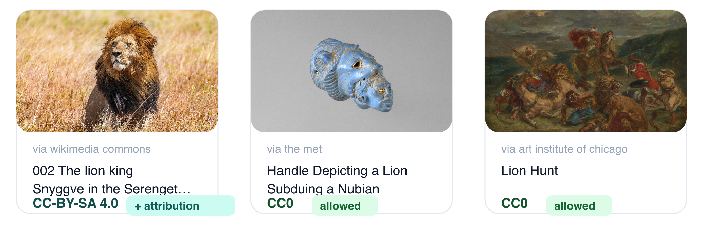

# refkit

Neutral, dependency-light **reference-retrieval toolkit for creative work** — search images / video / audio / text as creative references, with **per-result license normalization** so every result carries `source + license + attribution + canonicalUrl`.



> Apache-2.0 · pre-1.0 — results are **query-reranked by default** (`lexicalReranker`, zero-dependency) and providers only describe what their source knows (`EmittedReference`); core stamps the rest. The shape of `createRefkit` is settled, but while the library is 0.x a removed surface is removed, not aliased — read the changelog before upgrading.

## Why

Multimedia creators constantly "search X images as reference" / "find a Y passage for structure". No existing library combines all five of: **multi-source aggregation × per-result license normalization × agent-callable × embeddable BYOK SDK × visual AND text**. refkit fills that gap.

The defensible core is **not** multi-source fan-out (a commodity) — it is the **license normalization + strict-deny use-gate + dual-modal contract**, plus flowing results into a generation pipeline as provenance-carrying assets.

## Install

```bash
pnpm add @refkit/core @refkit/provider-openverse @refkit/provider-met
```

`@refkit/core` is the brain; each source is a thin `@refkit/provider-*` satellite you add as needed.

## Quickstart

```ts
import { createRefkit } from '@refkit/core'
import { openverse } from '@refkit/provider-openverse'
import { met } from '@refkit/provider-met'
import { unsplash } from '@refkit/provider-unsplash'

const refkit = createRefkit({
  providers: [
    openverse(),  // keyless
    met(),        // keyless
    unsplash({ accessKey: process.env.UNSPLASH_KEY! }), // BYOK
  ],
  // fetch defaults to globalThis.fetch — timeouts/retries/caching are built in (see below)
})

// Fan out, merge (Reciprocal Rank Fusion, weighted by how well each source
// answered) + dedup, then re-rank by query relevance — all on by default.
// Every result carries rights.
const refs = await refkit.search({ query: 'cyberpunk alley at night', modalities: ['image'], limit: 12 })

for (const r of refs) {
  // intents: 'internal-moodboard' | 'commercial-product' | 'ai-generation-input' | 'redistribution'
  const verdict = refkit.evaluateUse(r, 'commercial-product')
  // 'allowed' | 'allowed-with-attribution' | 'denied' | 'needs-review'
  if (verdict.decision === 'allowed-with-attribution') {
    console.log(r.canonicalUrl, refkit.buildAttribution(r).text)
  }
}

// Or gate at search time — only return commercially-usable results:
const safe = await refkit.search({ query: 'forest', modalities: ['image'], gateFor: 'commercial-product' })
```

## Search controls

Use provider-neutral `controls` for the main path. refkit routes each control only to providers that declare support, and `searchWithMeta()` explains which providers applied or ignored each control:

```ts
await refkit.search({
  query: 'brutalist library interior',
  modalities: ['image'],
  controls: {
    orientation: 'landscape',
    color: 'blue',
    language: 'en-US',
    sort: 'relevance',
    safety: 'strict',
    license: { commercial: true, modification: true },
    media: { minWidth: 1200, minHeight: 800 },
  },
})
```

Use `providerOptions` for provider-specific escape hatches that do not belong in the common contract. These are **typed whitelists**, not raw passthrough maps: each provider package translates the practical official search parameters it supports and ignores unsupported values.

```ts
await refkit.search({
  query: 'forest path',
  modalities: ['image'],
  controls: { orientation: 'landscape', safety: 'strict' },
  providerOptions: {
    unsplash: { collections: ['abc', 'def'], page: 2 },
    flickr: { tags: ['forest', 'path'], tagMode: 'all', minTakenDate: '2020-01-01' },
    brave: { country: 'US', searchLang: 'en', spellcheck: false },
    met: { departmentId: 11, isOnView: true },
    gutendex: { topic: 'children', sort: 'popular' },
  },
})
```

The provider package owns its native options surface, e.g. `UnsplashSearchOptions`, `FlickrSearchOptions`, `OpenverseImageSearchOptions`, `MetSearchOptions`, and `PoetryDbSearchOptions`. Response-format/debug parameters and auth-only knobs are intentionally omitted when they would break refkit's normalized `Reference` contract.

### Site-scoped discovery

Pass `sources` to restrict a search to specific provider ids (still intersected with modality matching; omit to fan out to every configured source). This is the clean way to point a web-discovery source at another site's index with a `site:` operator — without that operator leaking into the other providers' queries:

```ts
// Query Brave's index for Xiaohongshu nail-art notes — Brave only, so the
// `site:` operator never pollutes the other configured sources' queries.
const notes = await refkit.search({
  query: 'site:xiaohongshu.com 美甲',
  modalities: ['image'],
  sources: ['brave'],
})
```

A `sources` list that matches nothing for the requested modalities throws (a source typo fails loudly instead of reading as "no results"); an id that resolves to nothing while others still match is reported in `meta.warnings`, and every excluded provider appears in `meta.providers` with `reason: 'not-selected'`.

### Source routing & acceptance

A provider may declare `accepts({ text, modalities })` — a pure, fetch-free predicate that lets a narrow source opt out of queries it cannot answer. On an **unscoped** search a provider that returns `false` never runs: it is skipped with `reason: 'declined'` in `meta.providers` (routing, not a failure — no warning, no error). If every modality-matching provider declines, the search returns an empty result instead of throwing.

Naming a source in `sources` **bypasses** its `accepts` — asking for a source explicitly is the caller overriding the source's own judgement:

```ts
// nailbook indexes nothing but nail designs, so it declines "lion" on an
// unscoped search and the other sources answer alone…
await refkit.search({ query: 'lion', modalities: ['image'] })

// …but a motif-only query still reaches it when you ask for it by name.
await refkit.search({ query: '桜', modalities: ['image'], sources: ['nailbook'] })
```

Declaring it on a provider of your own — it must stay pure and dependency-free, since it runs before any request:

```ts
import { defineProvider, type EmittedReference } from '@refkit/core'

defineProvider({
  id: 'textures-only',
  modalities: ['image'],
  accepts: ({ text }) => /texture|material|pbr/i.test(text),
  search: async (_query, _ctx) => {
    const items: EmittedReference[] = []
    // fetch the upstream page and map each item to an EmittedReference
    return items
  },
})
```

When an agent or UI needs to explain what happened, use `searchWithMeta`:

```ts
const { references, meta } = await refkit.searchWithMeta({
  query: 'forest path',
  modalities: ['image'],
  controls: { orientation: 'landscape', color: 'green' },
  gateFor: 'commercial-product',
})

console.log(meta.controls?.appliedByProvider)
console.log(meta.controls?.ignoredByProvider)
console.log(meta.providers)
console.log(meta.warnings)
```

### Pagination ("load more")

Use the built-in cursor: every `searchWithMeta` result carries an opaque `meta.nextCursor`; pass it back as `cursor` and refkit advances the provider-local page **and dedupes against everything already returned** — no caller-side bookkeeping:

```ts
const batch1 = await refkit.searchWithMeta({ query: 'forest path', modalities: ['image'] })
const batch2 = await refkit.searchWithMeta({ query: 'forest path', modalities: ['image'], cursor: batch1.meta.nextCursor })
// batch2 never repeats batch1; an empty batch (no meta.nextCursor) means exhausted.
```

The cursor first **drains the overfetched pool** of the current provider page (each search fetches `limit × poolFactor` candidates but returns `limit`), and only then advances the provider-local page — so ranked results are never skipped. Under the hood `controls.page` is still provider-local (each source paginates its own stream; RRF-fused pages can overlap), which is exactly why the cursor tracks seen results for you. The seen set is capped (oldest evicted) so cursors stay small. Raw `controls.page` remains available if you want to manage pages yourself — then dedupe across pages by `canonicalizeUrl(r.canonicalUrl)`.

## Ranking & rerank

Every search fuses the per-source lists with **Reciprocal Rank Fusion** and then re-ranks the fused pool for the query. Both stages are on by default — no model, no network, nothing to configure:

1. **Source confidence** weights each source's RRF contribution by how much of the batch it returned actually mentions the query (`floor + (1 − floor) × hitRate`, floor `0.1`), so a source that answered something else stops out-ranking the ones that answered. Each fulfilled source reports its weight as `meta.providers[].confidence`.
2. **`lexicalReranker()`** then scores every candidate over `title + description + tags + text.excerpt` (CJK included, via character bigrams), blends in the fused relevance the candidate arrived with, adds a resolution boost, and emits greedily with a per-source diversity penalty plus a same-source near-duplicate-title penalty — so neither one provider nor one upload batch owns the top.

```ts
// Both defaults; nothing to pass.
const refs = await refkit.search({ query: 'cyberpunk alley at night', modalities: ['image'] })
```

Tune it client-wide, or override per call:

```ts
import { createRefkit, lexicalReranker } from '@refkit/core'

const refkit = createRefkit({
  providers,
  rerank: lexicalReranker({ fusionWeight: 0.8, qualityWeight: 0.3, licenseWeight: 0.2, sourceDiversity: 0.15 }),
})

// Per call: raw cross-source fusion order.
await refkit.search({ query: 'forest path', modalities: ['image'], rerank: false })
```

`LexicalRerankOptions` (every weight is clamped to ≥ 0; a negative or non-finite one reads as 0):

| option | default | what it adds to a candidate's score |
|---|---|---|
| `lexicalWeight` | `1` | fraction of the distinct query tokens present in the ranking text |
| `fusionWeight` | `0.5` | the **incoming fused relevance** — cross-source agreement and source confidence; `0` restores pure lexical order |
| `qualityWeight` | `0.15` | resolution (w×h) normalised to the batch max; `0.5` when the source declares none |
| `licenseWeight` | `0` | license permissiveness, computed from the record's own license **facts** |
| `sourceScoreWeight` | `0` | the source's `sourceScore`, min-max normalised *within* that source (upstream scales aren't comparable across sources) |
| `sourceDiversity` | `0.1` | penalty per ref already picked from the same source — steers order only, never the reported score |
| `nearDuplicatePenalty` | `0.25` | penalty for a title that nearly repeats one already picked from the same source — order only |
| `nearDuplicateThreshold` | `0.7` | not a weight: the title-token Jaccard at which "nearly repeats" begins. A value outside 0…1 falls back to the default — to switch the penalty off use `nearDuplicatePenalty: 0` |

For **semantic** ranking, bring your own — the `Reranker` hook receives `{ query, refs, signal }` and returns reordered refs, so you can wire a CLIP/embedding/LLM reranker to your own API. `core` ships no model; this is the only seam, and passing one replaces the lexical default:

```ts
rerank: async ({ query, refs }) => myEmbeddingRerank(query, refs)
```

`refText(ref)` (all of a ref's ranking text) and `tokenize(text)` are exported for BYO rerankers that want the same text and tokenizer core uses. Reranking runs post-merge, before the relevance threshold, the `gateFor` license filter and the limit.

Term matching understands CJK text (character bigrams), so Chinese/Japanese/Korean queries score against titles instead of tokenizing to nothing. Note that most bundled sources index English metadata — for best recall, query in English (or have your agent translate) even though ranking handles CJK.

### Relevance threshold

`minRelevance` drops results the ranker scored below the bar — after reranking, before the gate — and reports the cut in `meta.threshold` (plus a warning):

```ts
const { references, meta } = await refkit.searchWithMeta({
  query: 'lion',
  modalities: ['image'],
  minRelevance: 0.5,
})
meta.threshold // → { minRelevance: 0.5, dropped: 4 }
```

It is **off by default**: a bar can empty the batch, and only the caller can decide that beats weak results. Calibrate it against the reranker's *blended* score: under the stock weights a result matching **no** query term still lands around `0.3` (it keeps its fusion and quality terms) and a full match around `0.95`, so `0.5` is the practical "real matches only" line. The scale does not carry over to `rerank: false` — raw RRF is max-normalised, so there the top result is always exactly `1` and the rest sit just below it.

### Source confidence

```ts
createRefkit({ providers, sourceConfidence: { floor: 0.3 } }) // dampen a miss less
createRefkit({ providers, sourceConfidence: false })          // unweighted fusion
```

Confidence reaches the final **order** through the reranker's `fusionWeight`; with `fusionWeight: 0` — or a BYO reranker that ignores the incoming `relevance` — it only breaks ties among otherwise-equal refs and survives as the `meta.providers[].confidence` diagnostic. A fulfilled source that returned nothing reports no `confidence` at all: an empty batch neither mentions the query nor fails to.

### Descriptive fields

`Reference` carries `description`, `tags: string[]` and `sourceScore` alongside `title` and `text.excerpt` whenever the source supplies them — Met, Art Institute of Chicago, Wikimedia Commons and Rijksmuseum all populate descriptive fields, and Art Institute also passes through its upstream score. That is the text the reranker and the confidence weighting read, so richer source metadata directly sharpens ranking. `sourceScore` is a source-local scale: only the order within one source's results is meaningful, which is why `sourceScoreWeight` defaults to 0.

### Cross-source rights conflicts

Two sources describing the **same canonical URL** are making claims about one work. refkit compares their license **facts**, not their labels: identical facts under different ids (`CC0-1.0` vs `PD`) are no conflict, the same id with narrower supplied facts *is* one, and two sources both declaring `unknown` is not. A real conflict resolves to the stricter claim; incomparable claims (which includes anything indeterminate) collapse to `unknown` → needs-review. Every conflict lands in `meta.warnings` and reaches an optional `merge.onRightsConflict` observer:

```
cross-source rights conflict for https://example.org/x: CC-BY vs CC-BY-NC → resolved to CC-BY-NC.
cross-source rights conflict for https://example.org/y: CC-BY declared with differing facts → resolved to CC-BY.
```

Results never silently inherit the more permissive claim.

URL dedupe is built in, and perceptual hashes are supported when providers or hosts supply them. For host-computed fingerprints or embeddings, add a duplicate hook without making core fetch or decode media:

```ts
const refkit = createRefkit({
  providers,
  merge: {
    isDuplicate: (candidate, existing) =>
      (candidate.raw as { fingerprint?: string }).fingerprint ===
      (existing.raw as { fingerprint?: string }).fingerprint,
  },
})
```

## Resilience & caching

Fan-out is hardened by default: each provider gets a **soft 10s timeout** and **one retry** (429/5xx/network errors, exponential backoff). A slow or hanging source is reported in `meta.providers` as `failed` with `timeout after Nms` — the search still returns everyone else. Tune or disable per client:

```ts
createRefkit({ providers, resilience: { timeoutMs: 4000, retries: 2 } })
createRefkit({ providers, resilience: false }) // raw fan-out, no timeout/retry
```

`resilience.timeoutMs` bounds **one provider search**; `deadlineMs` bounds the **whole call**, cursor page advances included. Sources still in flight when it fires are reported as `failed` and everyone else's results come back:

```ts
await refkit.searchWithMeta({ query: 'forest', modalities: ['image'], deadlineMs: 3000 })
```

That is a hard bound while per-provider resilience is on (its deadline race abandons a provider that ignores the signal). With `resilience: false` there is no race left, so `deadlineMs` only binds providers that honour `ctx.signal` — refkit's own satellites all forward it into `fetch`. If the deadline fires while *every* provider is still in flight, the call rejects with an `AggregateError` (same as an all-providers-failed fan-out) rather than reporting an empty success.

With many sources registered, bound the fan-out with `concurrency` — at most N provider searches run at once (a queued provider's timeout only starts when its slot starts):

```ts
createRefkit({ providers, concurrency: 6 }) // default: unlimited
```

Pass a `cache` to memoize **per-provider** results (short fixed-shape hashed keys, safe for strict KV backends; the cached value embeds the full normalized query and is verified on read, so a key collision degrades to a miss instead of serving another query's results; TTL `cacheTtlMs`, default 5 min). Merging, reranking, and the license gate always run fresh; cache hits are flagged `cached: true` in `meta.providers`, and every provider status carries `latencyMs`. Pass `cacheRaw: false` to strip each result's `raw` provider payload from cache entries (smaller entries; raw-reading `isDuplicate` hooks then won't see `raw` on hits):

```ts
createRefkit({ providers, cache: myKvCache, cacheTtlMs: 60_000, cacheRaw: false })
```

## Providers

| Package | Source | Modality | Auth | License |
|---|---|---|---|---|
| `@refkit/provider-openverse` | Openverse (CC aggregator) | image · audio | keyless | per-item CC / PD |
| `@refkit/provider-wikimedia-commons` | Wikimedia Commons | image | keyless | per-item CC / PD |
| `@refkit/provider-met` | The Metropolitan Museum of Art | image | keyless | CC0 |
| `@refkit/provider-artic` | Art Institute of Chicago | image | keyless | CC0 |
| `@refkit/provider-smithsonian` | Smithsonian Open Access | image | API key | CC0 |
| `@refkit/provider-flickr` | Flickr | image | API key | per-item CC / PD |
| `@refkit/provider-unsplash` | Unsplash | image | API key | Unsplash |
| `@refkit/provider-pexels` | Pexels | image · video | API key | Pexels |
| `@refkit/provider-pixabay` | Pixabay | image · video | API key | Pixabay |
| `@refkit/provider-gutendex` | Project Gutenberg | text | keyless¹ | per-item PD |
| `@refkit/provider-poetrydb` | PoetryDB | text | keyless | PD |
| `@refkit/provider-brave` | Brave web search (discovery) | image (web) | API key | unknown → needs-review |
| `@refkit/provider-rijksmuseum` | Rijksmuseum | image | keyless | CC0 / PD |
| `@refkit/provider-polyhaven` | Poly Haven + ambientCG | image | keyless | CC0 |
| `@refkit/provider-freesound` | Freesound | audio | API key | per-item CC / CC0 |
| `@refkit/provider-jamendo` | Jamendo | audio | API key | per-item CC |
| `@refkit/provider-europeana` | Europeana | image | API key | per-item CC / PD / rights-statement |
| `@refkit/provider-internet-archive` | Internet Archive | video · text | keyless | per-item CC (dirty) → unknown |
| `@refkit/provider-nailbook` | Nailbook (Japanese nail art) | image | keyless | unknown → needs-review |

¹ gutendex's default host (`gutendex.com`) is the upstream maintainer's **test instance** — its docs say "You should run your own server", and its Cloudflare front blocks datacenter IPs. Desktop/local use works out of the box; for production or server-side traffic, [self-host Gutendex](https://github.com/garethbjohnson/gutendex) and pass `gutendex({ baseUrl: 'https://your-instance' })`. When blocked, the source degrades gracefully (a `failed` entry in `meta.providers`; other sources still return).

Audio/video are extra factories on existing packages: `openverseAudio()`, `pexelsVideo()`, `pixabayVideo()`. Modality routing is automatic — an `['audio']` search only hits audio-capable providers.

## Architecture

```
@refkit/core           neutral brain — zero network, zero providers, only zod
  EmittedReference → Reference contract · RightsModel + license facts ·
  strict-deny use-gate · confidence-weighted RRF merge/dedup · default lexical
  rerank + threshold · ReferenceProvider interfaces · dual-modal envelope

@refkit/provider-*      thin satellites — one source each; the commodity layer

@refkit/mcp             agent face — exposes search_references over MCP

(host binding)          maps Reference → the host's asset/generation model;
  injects keys (BYOK), fetch, cache. Lives in the consuming app, not here.
```

One search pass is a fixed pipeline: **select** (modality → `sources` → `kind` → the provider's own `accepts`) → **fan out** → **confidence** → **merge** (RRF + dedup + rights resolution) → **rerank** → **threshold** → **gate** → **seen-filter** → limit.

**Dependency direction is one-way:** `provider-*` → `core`; hosts → `core`. `core` depends on nothing but `zod`, and never on any host or orchestration framework.

### Providers describe, core completes

A provider's `search` returns `EmittedReference[]` — only what the **source** knows: `modality, kind?, title?, description?, tags?, sourceUrl, canonicalUrl?, rights, thumbnail?, preview?, perceptualHash?, visual?, text?, sourceScore?, raw?`. Core validates each item against `emittedReferenceSchema` at the boundary and then stamps everything that is its own concern — `id` (content-addressed from providerId + sourceUrl), `source`, `canonicalUrl` (defaults to `sourceUrl`), `verifiedAt`, `relevance` — and applies the per-provider `limit`. Providers never compute ids, never write provenance or scores, and never post-truncate; a satellite is a mapper plus a rights mapping.

## Core invariants (enforced by tests in `@refkit/core`)

- **Zero network in `core`** — no `fetch` call, no hard-coded endpoint. Hosts inject `ProviderContext.fetch`.
- **Core stamps its own fields** — `id`, `source`, `canonicalUrl`, `verifiedAt`, `relevance` and the `limit` come from core, never from a provider (`EmittedReference` → `Reference`).
- **Facts, not labels** — the use-gate, the merge's conflict resolution, attribution and the license boost all read license **facts** via `factsOf(rights)`: `LicenseId` is an open string, and a source whose terms are narrower than the label it declares ships its own `rights.facts` row. An id with no known facts resolves to the `unknown` row, which grants nothing.
- **No re-hosting** — keep `canonicalUrl` + thumbnails only; never store originals. `rights.rehostPolicy` records what the source permits; it is host-facing metadata that core validates and passes through but never acts on — enforcing it is the host binding's job.
- **strict-deny** — when rights can't be determined, deny / needs-review (never fail-open). Unknown, NonCommercial and "no known copyright restrictions" never map to a commercially usable license; NoDerivatives allows verbatim commercial reuse (with attribution) but never derivative/AI use.

## Agent usage

Agents can use refkit in two ways:

1. **SDK inside a host tool** — your app defines its own `search` tool, wires `createRefkit({ providers, fetch, cache })`, and controls keys, caching, retries, rerankers, search controls, and provider-specific options.
2. **MCP adapter** — `@refkit/mcp` exposes the same license-normalized search over `search_references`, useful when you want a zero-glue tool that works across MCP-capable agents.

## MCP

`@refkit/mcp` exposes `search_references` over the [Model Context Protocol](https://modelcontextprotocol.io), so any MCP-capable agent can search license-normalized references with zero glue code.

**Zero-config** — point an MCP client at:

```bash
npx -y @refkit/mcp
```

It boots with the keyless sources (Met, Art Institute, Wikimedia Commons, Openverse + audio, Project Gutenberg, PoetryDB, Rijksmuseum, Poly Haven, ambientCG, Internet Archive, Nailbook) and auto-adds any BYOK source whose key is in the environment (`REFKIT_UNSPLASH_KEY`, `REFKIT_PEXELS_KEY`, `REFKIT_BRAVE_KEY`, … — legacy names like `UNSPLASH_KEY`, `PEXELS_KEY`, `BRAVE_TOKEN` still work as fallbacks). Pass `intent` to annotate each result with a use-verdict (may I use this, is attribution required); `gateFor` to return only allowed results, with `gateContext: { userJurisdiction }` when the caller's jurisdiction matters; `minRelevance` to drop weak matches (calibrated against the reranker's blend — see [Relevance threshold](#relevance-threshold)); `rerank: false` for raw cross-source fusion order (reranking is **on by default**); `deadlineMs` to bound the whole call; `cursor` (from the previous result's top-level `nextCursor` — always returned, no `explain` needed) to page through results without repeats; `REFKIT_MAX_CURSOR_SEEN` shrinks the cursor for hosts that clamp tool-output strings. BYOK provider packages are `optionalDependencies` of `@refkit/mcp` — installed by default (zero-config `npx` keeps working), but an install with `--omit=optional` skips them, and a key whose package is missing just logs a stderr warning instead of crashing the server. Beyond search, `evaluate_use` and `build_attribution` expose the same license-verdict and attribution logic as standalone stateless tools, for when an agent already has a license id and just needs a verdict or a credit line. Or wire your own providers/keys via `serveStdio(createRefkit({ … }))` — see [`@refkit/mcp`](https://www.npmjs.com/package/@refkit/mcp).

## Not legal advice

`evaluateUse` returns a **conservative heuristic** based on source-declared license/ToS facts. It is **not legal advice** and does not determine legal rights. Every verdict carries a `disclaimer` and a `confidence`. For real legal posture (especially feeding references into AI generation), consult counsel.

## Develop

```bash
pnpm install
pnpm typecheck   # all packages
pnpm lint        # eslint (typescript-eslint, syntactic rules; tsc stays the type gate)
pnpm test:run    # all packages
pnpm build       # tsup → dist for every package
```

`REFKIT_LIVE=1 pnpm test:run` runs the live smoke suites against real provider APIs (BYOK ones need their key env vars set); the weekly cron in CI runs the same check.

Releases are automated with [changesets](https://github.com/changesets/changesets): run `pnpm changeset` to record a change; merging the CI-generated "Version Packages" PR publishes to npm.
